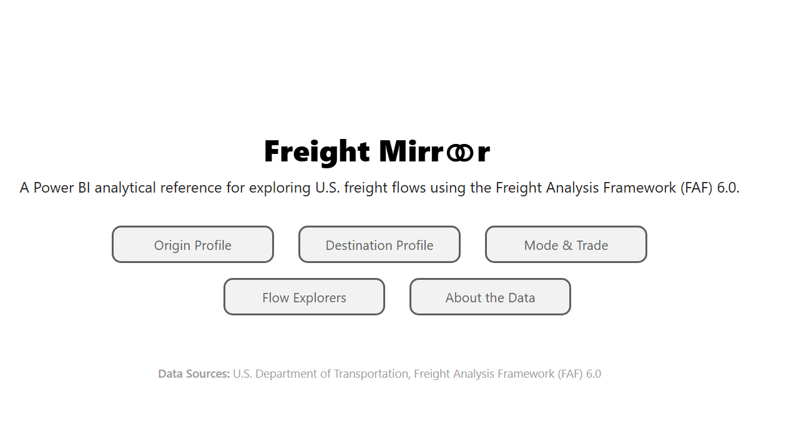
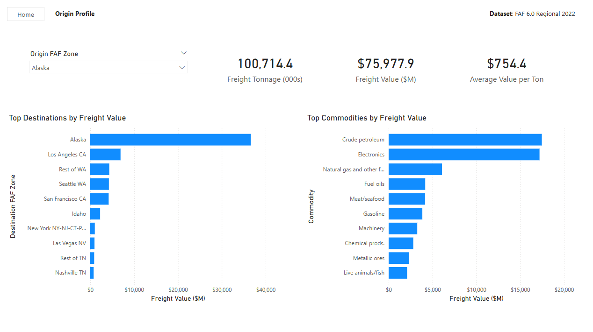
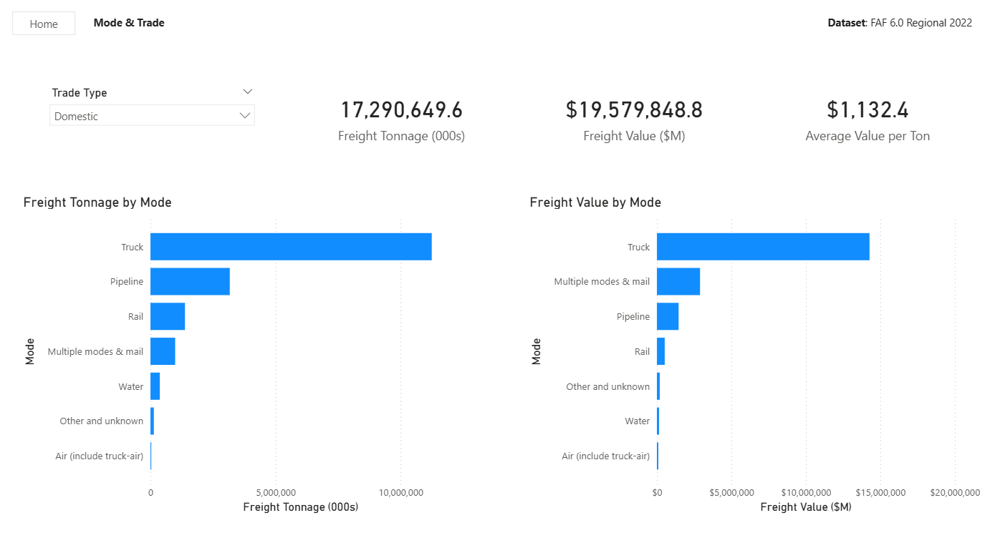
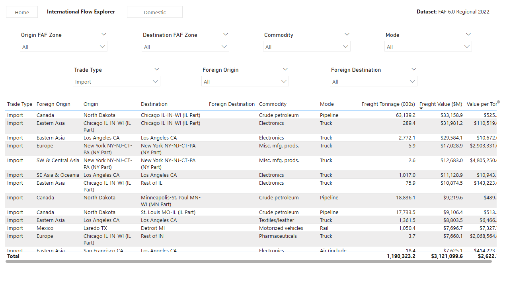

# Freight Mirror

Freight Mirror is a Power BI analytical reference for exploring U.S. freight flows using the U.S. Department of Transportation’s Freight Analysis Framework (FAF) 6.0 Regional dataset.

Version 1.0 provides a focused 2022 benchmark view of freight origins, destinations, commodities, transportation modes, trade types, tonnage, freight value, and value per ton.

## What Freight Mirror helps answer

- What kinds of freight originate in a particular U.S. region?
- Where does freight from that region go?
- What commodities are most important by freight value?
- Which transportation modes carry the most freight?
- How do tonnage and freight value tell different stories?
- How do domestic and international freight flows differ?
- Which foreign regions are associated with U.S. imports and exports?

## Report pages

Freight Mirror v1.0 includes seven report pages:

1. **Cover**  
   Navigation and report introduction.

2. **Origin Profile**  
   Explore freight originating in a selected FAF zone, including total tonnage, freight value, value per ton, top destinations, and top commodities.

3. **Destination Profile**  
   Explore freight arriving in a selected FAF zone, including total tonnage, freight value, value per ton, top origins, and top commodities received.

4. **Mode & Trade**  
   Compare freight tonnage and freight value across domestic transportation modes and trade types.

5. **Domestic Flow Explorer**  
   Explore domestic freight flows by origin, destination, commodity, and mode.

6. **International Flow Explorer**  
   Explore import and export flows using domestic and foreign geography, commodity, mode, tonnage, and freight value.

7. **About the Data**  
   Provides a concise explanation of the dataset, FAF geography, measures, international-flow structure, and current limitations.
   
## Core measures

Freight Mirror v1.0 uses three primary analytical measures:

- **Freight Tonnage (000s)** — thousands of tons
- **Freight Value ($M)** — millions of constant 2022 dollars
- **Average Value per Ton** — calculated from reported freight value and tonnage

Average Value per Ton is a calculated measure created within Freight Mirror.

## Data source

Freight Mirror v1.0 uses:

- **U.S. Department of Transportation**  
- **Freight Analysis Framework (FAF) 6.0**  
- **Regional 2022 data**

FAF provides origin-destination freight flows by geography, commodity, transportation mode, and trade type.

The underlying Freight Mirror model uses the FAF 6.0 Regional Access database and associated FAF metadata.

## Data model

The Power BI model is structured around the FAF regional freight-flow fact table with supporting dimensions for:

- Domestic origin FAF zone
- Domestic destination FAF zone
- Commodity
- Domestic mode
- Trade type
- Foreign origin region
- Foreign destination region
- Foreign inbound mode
- Foreign outbound mode

Role-playing dimensions are used where the same source classification serves different analytical roles, such as origin and destination geography.

## Scope of Version 1.0

Freight Mirror v1.0 is deliberately constrained to provide an analytically complete first release.

It focuses on the FAF 6.0 Regional 2022 benchmark and does not currently include:

- historical freight trends
- FAF forecasts
- state-level FAF analysis
- network assignments
- internal versus outbound flow analysis

The FAF trade classification includes an **Intransit** category, but no Intransit records are present in the FAF 6.0 Regional 2022 data used in this report.

## Interpretation

Freight Mirror is descriptive.

It is designed to show what the FAF data reports and to make freight-system structure easier to explore and compare.

Differences in freight value, tonnage, geography, commodity, or mode should not by themselves be interpreted as evidence of causation.

## Screenshots

### Cover

### Origin Profile

Explore freight originating in a selected FAF zone, including top destinations and commodities.

### Mode & Trade

Compare freight tonnage and freight value across transportation modes and trade types.

### International Flow Explorer

Explore import and export flows across domestic and foreign geography.

## Version

**Freight Mirror v1.0**

Initial release based on FAF 6.0 Regional 2022 freight data.

## Project

Freight Mirror is part of the broader **Mirror Projects** effort: analytical representations of real-world systems built from authoritative public data.

A Mirror is intended to help users understand what exists, how a system is organized, and what the available evidence shows.
